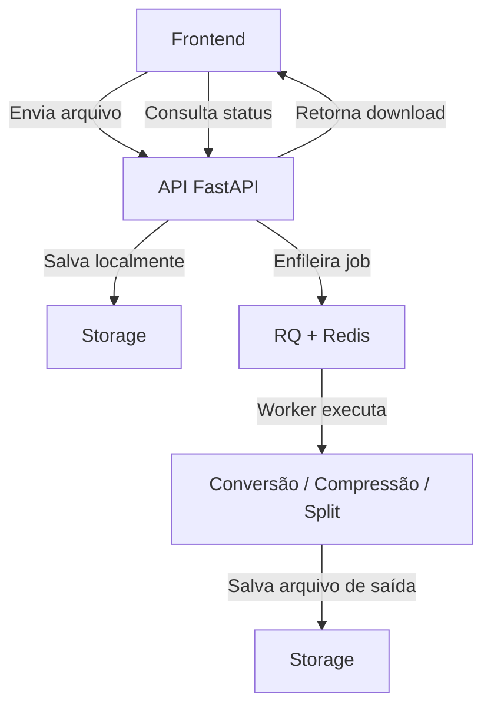

# 📄 Conversor de Arquivos com FastAPI + RQ

Este projeto é uma API desenvolvida com **FastAPI** e **Redis Queue (RQ)** para conversão e manipulação de arquivos, como PDF, Word, Imagens, Compressão e mais.

---

## ⚙️ Tecnologias Utilizadas

- **FastAPI**: Framework web moderno e rápido em Python
- **Redis**: Banco de dados em memória, utilizado como fila de tarefas
- **RQ (Redis Queue)**: Execução assíncrona de tarefas com Redis
- **LibreOffice**: Conversão de `.docx` para `.pdf`
- **Pillow (PIL)**: Conversão de imagens `.jpg` / `.png` para `.pdf`
- **Ghostscript**: Compressão de arquivos PDF
- **PyPDF2**: Junção e separação de arquivos PDF
- **Uvicorn**: Servidor ASGI para rodar o FastAPI

---

## 🖥️ Instalação

### ▶️ Criar ambiente virtual

**Windows**
```bash
python -m venv venv
venv\Scripts\activate
```

**Linux/macOS**
```bash
python3 -m venv venv
source venv/bin/activate
```

### 💾 Instalar dependências
```bash
pip install -r requirements.txt
```

> Para salvar novas dependências:
```bash
pip freeze > requirements.txt
```

---

## 🚀 Executando o Projeto

### 🔧 Subir a API
```bash
uvicorn app.main:app --reload
```

### 🧱 Subir o Redis
> Se estiver usando Docker:
```bash
docker run -d -p 6379:6379 redis
```

### 🧑‍💻 Iniciar o Worker
```bash
python app/workers/worker.py
```

### 🧑‍💻 Anter de iniciar o Worker, pode ser necessário rodar o seuinte comando:
```bash
export PYTHONPATH=$(pwd)
```
export PYTHONPATH=$(pwd)

### 📄 Acessar documentação
[http://127.0.0.1:8000/docs](http://127.0.0.1:8000/docs)

---

## 📂 Estrutura das Rotas da API

```text
/convert
│
├── /word
│   ├── POST      → Converte .docx em PDF
│   └── GET       → Verifica status do job
│
├── /pdf-to-word
│   ├── POST      → Converte PDF em .docx
│   └── GET       → Verifica status do job
│
├── /image
│   ├── POST      → Converte .jpg/.png em PDF
│   └── GET       → Verifica status do job
│
├── /pdf-to-image
│   ├── POST      → Converte PDF em imagens .jpg
│   └── GET       → Verifica status do job
│
├── /merge-pdf
│   ├── POST      → Junta múltiplos PDFs em um só (com ordenação)
│   └── GET       → Verifica status do job
│
└── /split-pdf
    ├── POST      → Divide um PDF em várias páginas ou páginas específicas
    └── GET       → Verifica status do job

/compress
│
└── /pdf
    ├── POST      → Comprime arquivo PDF
    └── GET       → Verifica status do job
```

---

## 🧠 Como Funciona

1. O usuário envia um arquivo via frontend
2. O backend salva o arquivo localmente
3. Um job assíncrono é criado e enfileirado com **RQ + Redis**
4. Um worker executa esse job em background
5. O frontend consulta o status do job via `GET`
6. Ao finalizar, o arquivo convertido é entregue para download

---

## 📌 Exemplo de Fluxo



---

## 📬 Contato

<!-- Desenvolvido por **Thales Santos**  
📧 [thales@thales.com]  
🔗 [github.com/tahels] -->

---
